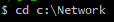

# Git과 Github 연동하기

먼저 폴더를 만든후 dir을 자신이 만든 폴더로 이동한다.

README를 만듬

git을 초기화 시켜준다

add 명령어를 사용하여 README를 추가시켜준다.

commit을 한다.

연동

연동

브랜치를 main이라고 짓는다

자신이 만든 repository의 주소를 넣는다.

그런 후 push를 하면 github에 올라간다

